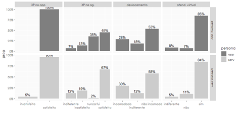
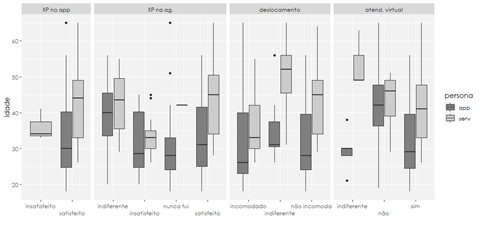
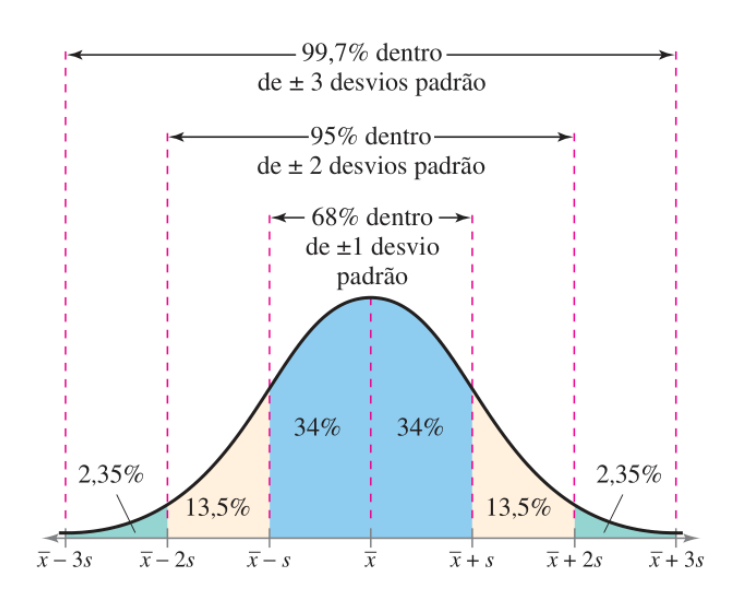
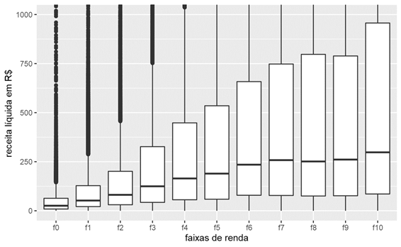
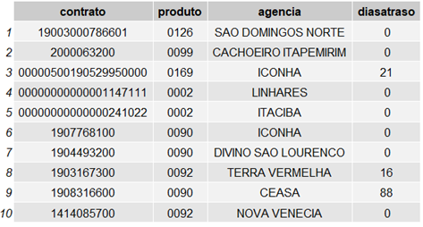

```{r configs, echo = FALSE}

# opções
knitr::opts_chunk$set(
    echo = FALSE,
    warning = FALSE,
    out.width = "80%",
    fig.align = "center"
)

# reprodutibilidade
set.seed(100)

# pacotes
library(ggplot2)
library(ggrepel)

```

<!-- capa -->
\thispagestyle{empty}
\begin{center}
\includegraphics[width=2in,height=2in]{img/logo.png} \\
\vspace{5cm}
\Large \uppercase{SELEÇÃO ESTÁGIO \\ 2022}
\end{center}

\vspace{6cm}

Candidato: `r params$candidato`

Assinatura:

<!-- orientações -->

\newpage
\setcounter{page}{1}

# ORIENTAÇÕES {-}

\vspace{5cm}
Não é permitido o uso de quaisquer aparelhos eletrônicos durante a prova, exceto calculadora.

Iniciada a prova, o candidato poderá se retirar apenas após a entrega do caderno.

Todas as questões são discursivas e exigem justificativas. Utilize caneta.

<!-- prova -->

\newpage

# RACIOCÍNIO LÓGICO-MATEMÁTICO

## QUESTÃO 1 {-}

Um cliente Banestes tem uma operação de crédito com taxa pós-fixada 1% a.m. + Selic. Isso significa que os juros são constituídos por uma parte pré-fixada, capitalizada mensalmente em dias corridos, e uma parte pós-fixada, capitalizada mensalmente em dias úteis.

Considerando um mês de 30 dias com 21 dias úteis e que o Bacen tenha publicado a Selic *over* efetiva anual em 10,75%, quais serão os juros nesse mês para um montante $M$?

\newpage
## QUESTÃO 2 {-}

O novo Banescard Visa começou a ser distribuído para os clientes Banestes e você está encarregado de classificá-los para receber um dos quatro tipos de cartões: Classic, Gold, Platinum ou Infinite. Considerando apenas as dimensões *renda mensal* e *média de transação em crédito*, você determina qual cartão cada cliente irá receber a partir da sua distância em relação à média de cada um dos grupos.

Qual cartão o cliente A irá receber?

```{r}

centroides <- data.frame(
    cartao = c("classic", "gold", "platinum", "infinite"),
    renda = c(2, 4, 9, 18),
    transacao = c(1, 2, 4, 10)
)

clientes <- data.frame(
    cliente = c("A"),
    renda = c(15),
    transacao = c(5)
)

ggplot(centroides, aes(renda, transacao, shape = factor(2:5))) +
    geom_point() +
    geom_point(data = clientes, aes(renda, transacao), shape = factor(1)) +
    geom_text_repel(label = paste0(
        "(", centroides$renda, ", ", centroides$transacao, ")")) +
    geom_text_repel(
        aes(renda, transacao, shape = factor(2)),
        data = clientes,
        label = clientes$cliente) +
    scale_shape_manual(labels = centroides$cartao, values = 2:5) +
    labs(
        x = "Renda Mensal (R$ mil)",
        y = "Média de Transação (R$ mil)",
        shape = "média"
    )
```

\newpage
## QUESTÃO 3 {-}

Considere o vetor $v$ a seguir:
$$ v = [-2, -1, 0, 2, 4, 8, 16, 32, 64] $$

Suponha que o pesquisador tente realizar transformações em $v$ utilizando as seguintes funções:

1. $f(v) = log(v)$
2. $g(v) = \sqrt{v}$
3. $h(v) = \frac{1}{\sigma\sqrt{2\pi}}e^{\frac{-(v-\mu)^2}{2\sigma^2}}$

Em quais funções o pesquisador encontrará problemas? Justifique.

\newpage
# QUESTÃO 4 {-}

Você precisa realizar uma pesquisa com clientes do Banestes sobre a utilização do app. Para determinar o tamanho da amostra necessária, você utiliza a função abaixo:
$$ f(n) = \frac{\frac{z^2p(1-p)}{m^2}}{1+\frac{z^2p(1-p)}{m^2n}} $$

Em que $z$, $m$ e $p$ são parâmetros definidos por você, e $n$ a variável independente:
$z$ = escore z (nível de significância)
$n$ = tamanho da população
$m$ = margem de erro
$p$ = proporção esperada

Optando pelos parâmetros $z=1,96$ (95% de significância), $m=5%$ e $p=50%$, você percebeu que para o município de Vila Velha (171 mil habitantes) e para o município de Ecoporanga (23 mil habitantes) os tamanhos das amostras necessárias para a pesquisa são semelhantes (383 e 377, respectivamente). Por quê?

\newpage
# RACIOCÍNIO SOBRE DADOS E MEDIDAS ESTATÍSTICAS

## QUESTÃO 1 {-}

Explique, com suas palavras, os conceitos de:

1. Desvio-padrão;
2. Variância;
3. Mediana;
4. Média;
5. Moda.

\newpage
## QUESTÃO 2 {-}

Em sua pesquisa de satisfação, para a qual você extraiu duas amostras aleatórias com os perfis app (clientes que abriram conta via app) e serv (clientes que abriram conta via agência e utilizam o app), você buscou avaliar o sentimento do cliente em relação a:

1. Experiência no app;
2. Experiência no atendimento presencial;
3. Necessidade do deslocamento à agência para preencher ou assinar documentos;
4. Interesse em ser atendido pela agência virtual.

A partir da interpretação dos gráficos plotados abaixo, qual a sua conclusão? 

```{r}

```

```{r}

```

\newpage
## QUESTÃO 3 {-}

O escore padrão ou escore-*z* representa o número de desvios padrão em que um valor $x$ enconta-se a partir da média $\mu$. Ele é muito utilizado pois permite recodificar os valores originais e padronizá-los em termos de desvio-padrão da média, tornando comparáveis grupos diferentes de dados.
$$z = \frac{x - \mu}{\sigma}$$

Para conjuntos de dados com distribuições que são aproximadamente simétricas e com forma de sino, o desvio padrão tem as seguintes características:

1. Cerca de 68% dos dados encontram-se dentro do intervalo de $\pm 1$ desvio padrão em relação à média.
2. Cerca de 95% dos dados encontram-se dentro do intervalo de $\pm 2$ desvios padrão em relação à média.
3. Cerca de 99.7% dos dados encontram-se dentro do intervalo de $\pm 3$ desvios padrão em relação à média.

```{r}

```

Suponha que a renda dos clientes Banestes seja distribuída de forma simétrica e em sino, com média R$ 3,6 mil e desvio-padrão R$ 18 mil.

Sabendo que $|\text{escores-z}| < 2$ são considerados comuns, $2 < |\text{escores-z}| < 3$ são incomuns e $|\text{escores-z}| > 3$ são muito incomuns, classifique as seguintes rendas:

1. R$ 5 mil
2. R$ 10 mil
3. R$ 30 mil
4. R$ 50 mil

\newpage
## QUESTÃO 4 {-}

O gráfico fictício abaixo simula o retorno financeiro dos clientes Banestes em suas operações de crédito. Cada faixa $f_i$ representa um intervalo de renda mensal em reais, sendo:
$$f_0 = [0, 1000], f_1 = [1000, 2000], …, f_{10} = [10000, 11000]$$

Que informações podem ser extraídas desse gráfico?

```{r}

```

\newpage
# NOÇÕES DE EXCEL, R E SQL

A tabela *data* abaixo será utilizada nas próximas questões:

```{r}

```

SQL é a linguagem padrão para armazenamento, manipulação e obtenção de dados em bancos de dados relacionais, baseado em tabelas. A estrutura padrão para buscar dados em uma tabela utilizando SQL é:

\begin{flushleft}
SELECT coluna1, coluna2, ... \linebreak
FROM nomedatabela \linebreak
WHERE condição;
\end{flushleft}

A instrução SELECT é usada para selecionar dados de um banco de dados. A cláusula WHERE é usada para filtrar registros e extrair apenas aqueles que atendem a uma condição específica. Os operadores mais comuns da Cláusula WHERE estão na tabela abaixo:

```{r}

data.frame(
    Operadores = c(
        "=", ">", "<", ">=", "<=", "<> ou !=", "BETWEEN", "IN"
        ),
    Descricao = c(
        "Igual",
        "Maior que",
        "Menor que",
        "Maior que ou igual",
        "Menor que ou igual",
        "Diferente",
        "Entre um determinado intervalo",
        "Para especificar vários valores possíveis para uma coluna"
    )
)
```

Para selecionar os contratos da agência Ceasa da tabela “data”, a sintaxe utilizada seria:

\begin{flushleft}
SELECT contrato \linebreak
FROM data \linebreak
WHERE agencia = 'CEASA';
\end{flushleft}

\newpage
## QUESTÃO 1 {-}

Escreva as sintaxes em SQL que retornam os itens abaixo da tabela data:

1. Todos os contratos da tabela menos os da agência ICONHA;
2. As colunas contrato, produto, agência e diasatraso dos produtos 0090 e 0092;
3. As agências com dias de atraso maior que 30 e menor que 90;
4. A média de atraso dos contratos da agência Iconha.

\newpage
## QUESTÃO 2 {-}

O Microsoft Excel é amplamente usado por empresas e particulares para a realização de operações financeiras e contabilísticas usando planilhas. Escreva a expressão para calcular ou atender cada item abaixo:
1. Quantidade de contratos com atraso maior do que 0 dias;
2. Criar uma coluna Situação que deve conter a palavra ‘ATRASO’ quando a quantidade de dias em atraso for maior que 0. Caso contrário, a expressão "Em dia" deve ser usada.

FÓRMULAS: \linebreak
=SE(teste_lógico;[valor_se_verdadeiro];[valor_se_falso]) \linebreak
=CONT.SE(intervalo; critérios)

\newpage
## QUESTÃO 3 {-}

O R é uma linguagem utilizada principalmente em estatística e visualização de dados, mas que foi estendida para uma linguagem general purpose, podendo ser usada para criação de aplicações web e até mesmo interfaces de jogos. Em R, há várias formas de manipular dados. Uma delas é através do pacote dplyr.

De acordo com a definição presente no site deste pacote: 
\begin{citacao}

dplyr is a grammar of data manipulation, providing a consistent set of verbs that help you solve the most common data manipulation challenges, There are five key dplyr functions that allow you to solve the vast majority of your data manipulation challenges: 1) filter; 2) arrange; 3) select; 4) mutate; 5) summarise.
The function select() picks variables based on their names. The function filter() allows you to subset observations based on their values. The first argument is the name of the data frame. The second and subsequent arguments are the expressions that filter the data frame. To use filtering effectively, you have to know how to select the observations that you want using the comparison operators. R provides the standard suite: >, >=, <, <=, != (not equal), and == (equal).

\end{citacao}

Logo, para selecionar os contratos com dias de atraso maior que 0 da tabela “data”, a sintaxe utilizada seria:

> data %>% filter(diasatraso > 0) %>% select(contrato)

Escreva as sintaxes em R que retornam os itens abaixo da tabela “data”. Obs.: caso deseje utilizar outro pacote, fique à vontade.

1. Todos os contratos da tabela, exceto os da agência ICONHA;
2. As colunas contrato, produto, agência e diasatraso dos produtos 0090 e 0092;
3. As agências com dias de atraso entre 30 e 90 dias;

\newpage
# REDAÇÃO

## TEXTO 1 {-}

Em março, o Indicador Ipea de Inflação por Faixa de Renda registrou taxas de inflação variando entre 1,24% para as famílias pertencentes aos estratos de renda mais alta e 1,74% no segmento de renda mais baixa. No acumulado no ano até março, a inflação varia entre 2,68% para o segmento de renda alta e 3,40% para o segmento de renda muito baixa. No acumulado em doze meses, a inflação varia entre 10% para as famílias de renda mais alta e 12% para as de renda mais baixa. De acordo com os dados desagregados, observa-se que, de maneira geral, as maiores contribuições à inflação, em março, vieram dos grupos “alimentação e bebidas” e “transportes”. Nota-se, entretanto, que, enquanto para as duas classes de renda mais baixa a alta dos preços dos alimentos no domicílio foi o principal fator de pressão inflacionária, para os demais segmentos os aumentos do grupo transportes, especialmente dos combustíveis, formam os maiores pontos de impacto inflacionário. (*Carta de Conjuntura, número 55, IPEA, abril de 2022*)

## TEXTO 2 {-}

**Reunião do Copom nesta quarta-feira deve elevar juro básico pela 11ª vez consecutiva, prevê mercado**.

O Comitê de Política Monetária (Copom) do Banco Central se reúne nesta quarta-feira (15) para definir a taxa básica de juros da economia.

A expectativa da maior parte dos economistas do mercado financeiro é que a Selic seja elevada em 0,5 ponto percentual, passando dos atuais 12,75% para 13,25% ao ano. A decisão sobre a Selic será anunciada após as 18h. O objetivo da alta no juro é tentar conter o aumento da inflação. O IPCA — a inflação oficial do país — ficou em 0,47% em maio, com desaceleração na comparação com o mês anterior. Mesmo assim, acumulou um aumento de 11,73% em doze meses.

Neste momento, o BC já está ajustando a taxa Selic para atingir a meta de inflação do ano que vem, uma vez que as decisões sobre juros demoram de seis a 18 meses para terem impacto pleno na economia. (*G1, 15/06/2022*)

# PROPOSTA DE REDAÇÃO {-}

A partir da leitura dos textos e com base nos conhecimentos adquiridos ao longo de sua formação, redija um texto dissertativo sobre o tema "Eficiência do Controle dos Juros na Inflação".

\newpage

# FOLHA DE REDAÇÃO {-}
